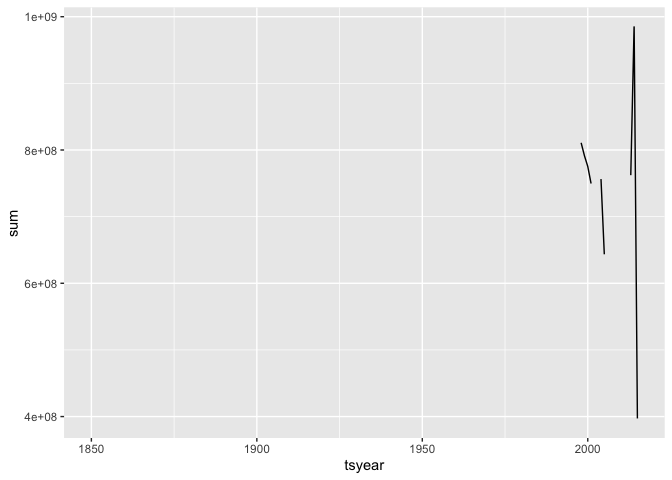

# Unit 3: Fisheries Collapse Module

This module will focus on understanding and replicating fisheries stock
assessment data and fisheries collapse.

Instead of working with independent dataframes, we will be working with
a large relational database which contains many different tables of
different sizes and shapes, but that all all related to eachother
through a series of different ids.

## The Database

We will use data from the [RAM Legacy Stock Assessment
Database](https://doi.org/10.5281/zenodo.2542918)

First, load in the necessary libraries. Note that this time we need a
package we haven’t used before `readxl`. This package is useful for
reading in .xls or .xlsx files. As always if you want more info on a
package run `?readxl` after loading it.

``` r
library("tidyverse")
library("readxl")
```

## Reading in the tables

First thing, you are going to need to download and unzip the files.
Although you don’t need to do this step more than once, Travis will need
this code to be able to reproduce you work successfully, unless you
choose to push the datafiles up to
git.

``` r
excel_version <- "RLSADB v4.44/DB Files With Assessment Data/RLSADB v4.44 (assessment data only).xlsx"
if(!file.exists(excel_version)){
  download.file("https://zenodo.org/record/2542919/files/RLSADB%20v4.44.zip?download=1",
                "ramlegacy.zip")
unzip("ramlegacy.zip") 
}
```

``` r
sheets <- readxl::excel_sheets(excel_version) #use the readxl package to identify sheet names 
ram <- lapply(sheets, readxl::read_excel, path = excel_version)  #read the data from all 3 sheets into a list
names(ram) <- sheets # give the list of datatables their assigned sheet names

## check your names
names(ram)
```

    ##  [1] "area"                         "assessment"                  
    ##  [3] "assessmethod"                 "assessor"                    
    ##  [5] "biometrics"                   "bioparams"                   
    ##  [7] "bioparams_assessments_views"  "bioparams_ids_views"         
    ##  [9] "bioparams_notes_views"        "bioparams_sources_views"     
    ## [11] "bioparams_units_views"        "bioparams_values_views"      
    ## [13] "management"                   "stock"                       
    ## [15] "taxonomy"                     "timeseries"                  
    ## [17] "timeseries_assessments_views" "timeseries_ids_views"        
    ## [19] "timeseries_notes_views"       "timeseries_sources_views"    
    ## [21] "timeseries_units_views"       "timeseries_values_views"     
    ## [23] "timeseries_years_views"       "tsmetrics"

``` r
## check your data
head(ram$area)
```

    ## # A tibble: 6 x 6
    ##   country  areatype areacode areaname          alternateareana… areaid     
    ##   <chr>    <chr>    <chr>    <chr>             <chr>            <chr>      
    ## 1 Argenti… CFP      ARG-N    Northern Argenti… NA               Argentina-…
    ## 2 Argenti… CFP      ARG-S    Southern Argenti… NA               Argentina-…
    ## 3 Austral… AFMA     CASCADE  Cascade Plateau   NA               Australia-…
    ## 4 Austral… AFMA     EAUS     Eastern Australia NA               Australia-…
    ## 5 Austral… AFMA     ESE      Eastern half of … NA               Australia-…
    ## 6 Austral… AFMA     GAB      Great Australian… NA               Australia-…

Side Note: You may notice the `lapply` function above. This function
applies a given function (in this case “read\_excel”) to all elements in
a vector or list. This is the same as writing out read\_excel for all
the sheets contained in our file, or writing a for loop `for(i
in 1:length(sheets)){read_excel(sheets[i])}`. These are very powerful
functions we will learn more about later. For now, it’s enough to
recognize why we have used it here. You can find more info in
[Chapter 21 of the R4ds book](http://r4ds.had.co.nz/iteration.html).

# Exercise 1: Investigating the North-Atlantic Cod

Now we are ready to dive into our data. First, We seek to replicate the
following figure from the Millenium Ecosystem Assessment Project using
the RAM data.

``` r
tbl <-
ram$timeseries %>%
  left_join(ram$stock) %>%
  left_join(ram$area) %>%
  left_join(ram$tsmetrics, by = c("tsid" = "tsunique")) %>%
  filter(scientificname == "Gadus morhua",
         country == 'Canada' | country == 'USA') 

  ram$tsmetrics %>% filter(tscategory == 'CATCH or LANDINGS') %>% count(tslong)
```

    ## # A tibble: 17 x 2
    ##    tslong                                                                 n
    ##    <chr>                                                              <int>
    ##  1 Catch divided by MSY                                                   1
    ##  2 Catch or landings that is paired with TAC                              2
    ##  3 Customary catch                                                        1
    ##  4 General total Catch (TC then TL, MT units only)                        1
    ##  5 Illegal catch                                                          1
    ##  6 Recreational catch                                                     2
    ##  7 Scientific advice for catch limit (pairs with Cpair and TAC)           1
    ##  8 Total allowable catch                                                  2
    ##  9 Total allowable catch In area greater than that of stock               1
    ## 10 Total allowable catch In subarea                                       5
    ## 11 Total catch (i.e. landings + discards. Add landings + discards to…     9
    ## 12 Total catch in subarea (i.e. landings + discards. Add landings + …     3
    ## 13 Total catch. Use only when there is more than 1 accepted 'total c…    10
    ## 14 Total landings                                                         7
    ## 15 Total landings combined beyond just this stock (species, area, et…     1
    ## 16 Total landings in subarea                                              5
    ## 17 Total landings. Use only when there is more than 1 accepted 'tota…     5

``` r
landings_tbl <-
tbl %>%
  filter(tslong == 'Total catch (i.e. landings + discards. Add landings + discards to get this).')
landings_tbl
```

    ## # A tibble: 442 x 23
    ##    assessid stockid stocklong tsid  tsyear tsvalue    tsn scientificname
    ##    <chr>    <chr>   <chr>     <chr>  <dbl>   <dbl>  <dbl> <chr>         
    ##  1 DFO-COD… COD3Ps  Atlantic… TC-MT   1980   37600 164712 Gadus morhua  
    ##  2 DFO-COD… COD3Ps  Atlantic… TC-MT   1981   38900 164712 Gadus morhua  
    ##  3 DFO-COD… COD3Ps  Atlantic… TC-MT   1982   33900 164712 Gadus morhua  
    ##  4 DFO-COD… COD3Ps  Atlantic… TC-MT   1983   38500 164712 Gadus morhua  
    ##  5 DFO-COD… COD3Ps  Atlantic… TC-MT   1984   37000 164712 Gadus morhua  
    ##  6 DFO-COD… COD3Ps  Atlantic… TC-MT   1985   51400 164712 Gadus morhua  
    ##  7 DFO-COD… COD3Ps  Atlantic… TC-MT   1986   58000 164712 Gadus morhua  
    ##  8 DFO-COD… COD3Ps  Atlantic… TC-MT   1987   59200 164712 Gadus morhua  
    ##  9 DFO-COD… COD3Ps  Atlantic… TC-MT   1988   43400 164712 Gadus morhua  
    ## 10 DFO-COD… COD3Ps  Atlantic… TC-MT   1989   39500 164712 Gadus morhua  
    ## # … with 432 more rows, and 15 more variables: commonname <chr>,
    ## #   areaid <chr>, region <chr>, inmyersdb <dbl>, myersstockid <chr>,
    ## #   country <chr>, areatype <chr>, areacode <chr>, areaname <chr>,
    ## #   alternateareaname <chr>, tscategory <chr>, tsshort <chr>,
    ## #   tslong <chr>, tsunitsshort <chr>, tsunitslong <chr>

``` r
grouped <- tbl %>% group_by(tsyear) %>% summarize(sum = sum(tsvalue))
grouped
```

    ## # A tibble: 166 x 2
    ##    tsyear   sum
    ##     <dbl> <dbl>
    ##  1   1850    NA
    ##  2   1851    NA
    ##  3   1852    NA
    ##  4   1853    NA
    ##  5   1854    NA
    ##  6   1855    NA
    ##  7   1856    NA
    ##  8   1857    NA
    ##  9   1858    NA
    ## 10   1859    NA
    ## # … with 156 more rows

``` r
ggplot(grouped, aes(x = tsyear, y= sum)) + geom_line()
```

    ## Warning: Removed 148 rows containing missing values (geom_path).

<!-- -->


``` r
ram$timeseries
```

    ## # A tibble: 951,775 x 6
    ##    assessid            stockid stocklong            tsid     tsyear tsvalue
    ##    <chr>               <chr>   <chr>                <chr>     <dbl>   <dbl>
    ##  1 ABARES-BGRDRSE-196… BGRDRSE Blue Grenadier Sout… ERbest-…   1979 0.00702
    ##  2 ABARES-BGRDRSE-196… BGRDRSE Blue Grenadier Sout… ERbest-…   1980 0.0129 
    ##  3 ABARES-BGRDRSE-196… BGRDRSE Blue Grenadier Sout… ERbest-…   1981 0.00829
    ##  4 ABARES-BGRDRSE-196… BGRDRSE Blue Grenadier Sout… ERbest-…   1982 0.0134 
    ##  5 ABARES-BGRDRSE-196… BGRDRSE Blue Grenadier Sout… ERbest-…   1983 0.0145 
    ##  6 ABARES-BGRDRSE-196… BGRDRSE Blue Grenadier Sout… ERbest-…   1984 0.0215 
    ##  7 ABARES-BGRDRSE-196… BGRDRSE Blue Grenadier Sout… ERbest-…   1985 0.0204 
    ##  8 ABARES-BGRDRSE-196… BGRDRSE Blue Grenadier Sout… ERbest-…   1986 0.038  
    ##  9 ABARES-BGRDRSE-196… BGRDRSE Blue Grenadier Sout… ERbest-…   1987 0.0599 
    ## 10 ABARES-BGRDRSE-196… BGRDRSE Blue Grenadier Sout… ERbest-…   1988 0.0489 
    ## # … with 951,765 more rows

**How does your graph compare to the one presented above?**

-----

# Exercise 2: Group Assignment

## Stock Collapses

We seek to replicate the temporal trend in stock declines shown in [Worm
et al 2006](http://doi.org/10.1126/science.1132294):


