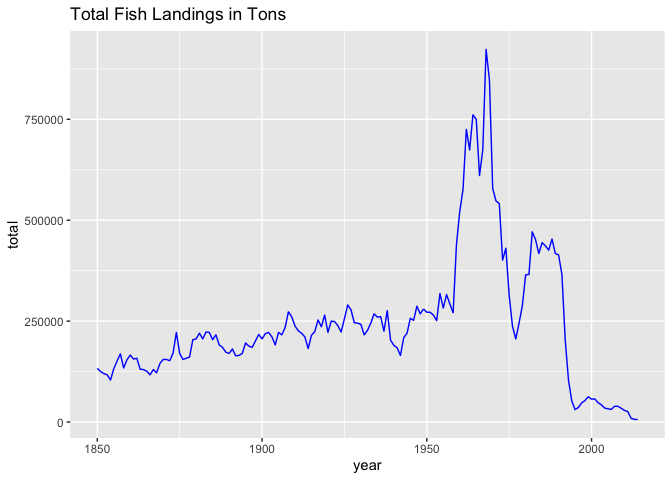

# Unit 3: Fisheries Collapse Module

## Introduction

In this module we looked into the analysis of global fisheries conducted
by Worm et al., in “Impacts of Biodiversity Loss on Ocean Ecosystem
Service” in 2006. We attempted to reproduce figure 3A from this paper,
which shows the trajectories of collapsed fish and invertebrate taxa
over the past 50 years, and explored the very contraversial claim made
by Worm et al. that in 2048, it’s projected that the global collapse of
all taxa currently fished will occur with a rate of 100% based on
extrapolation of a regression model they ran using figure 3A data.

We also replicated a graph from the Millenium Ecosystem Assessment
Project to explore the total fish landings of North Atlantic Cod, which
showed a very clear increase of Cod being caught in the 1960s, following
a dip in Cod being caught around 1975. Another dip occured right before
2000 which was right after the Cod stock started to replenish, which
indicates that there is a downward trend in total Cod landings, but this
is no where near enough information to support the claim from Worm et
al.

Worm et al. also explores ideas that the fishery collapse is correlated
with loss of biodiversity. Their analysis indicates that marine
biodiversity is declining in almost all areas, and this is effecting
many parts of the ecosystem such as estuaries and coral reefs. The graph
we attempted to reproduce breaks up the taxa by species-rich and
species-poor to clearly show that fishery collapses occurred at a higher
rate in species-poor ecosystems than in species-rich ecosystems, but
overall, both saw a downward trend. We will not be replicating any
figures or analysis on species diversity, but it is important to
understand this one feature of many as to why fisheries are seeing an
overall decline.

This module will focus on understanding and replicating fisheries stock
assessment data and fisheries collapse.

Instead of working with independent dataframes, we will be working with
a large relational database which contains many different tables of
different sizes and shapes, but that all all related to eachother
through a series of different ids.

## The Database

We will use data from the [RAM Legacy Stock Assessment
Database](https://doi.org/10.5281/zenodo.2542918)

First, load in the necessary libraries. Note that this time we need a
package we haven’t used before `readxl`. This package is useful for
reading in .xls or .xlsx files. As always if you want more info on a
package run `?readxl` after loading it.

``` r
library("tidyverse")
library("readxl")
```

## Reading in the tables

First thing, you are going to need to download and unzip the files.
Although you don’t need to do this step more than once, Travis will need
this code to be able to reproduce you work successfully, unless you
choose to push the datafiles up to
git.

``` r
excel_version <- "RLSADB v4.44/DB Files With Assessment Data/RLSADB v4.44 (assessment data only).xlsx"
if(!file.exists(excel_version)){
  download.file("https://zenodo.org/record/2542919/files/RLSADB%20v4.44.zip?download=1",
                "ramlegacy.zip")
unzip("ramlegacy.zip") 
}
```

``` r
sheets <- readxl::excel_sheets(excel_version) #use the readxl package to identify sheet names 
ram <- lapply(sheets, readxl::read_excel, path = excel_version)  #read the data from all 3 sheets into a list
names(ram) <- sheets # give the list of datatables their assigned sheet names

## check your names
names(ram)
```

    ##  [1] "area"                         "assessment"                  
    ##  [3] "assessmethod"                 "assessor"                    
    ##  [5] "biometrics"                   "bioparams"                   
    ##  [7] "bioparams_assessments_views"  "bioparams_ids_views"         
    ##  [9] "bioparams_notes_views"        "bioparams_sources_views"     
    ## [11] "bioparams_units_views"        "bioparams_values_views"      
    ## [13] "management"                   "stock"                       
    ## [15] "taxonomy"                     "timeseries"                  
    ## [17] "timeseries_assessments_views" "timeseries_ids_views"        
    ## [19] "timeseries_notes_views"       "timeseries_sources_views"    
    ## [21] "timeseries_units_views"       "timeseries_values_views"     
    ## [23] "timeseries_years_views"       "tsmetrics"

``` r
## check your data
head(ram$area)
```

    ## # A tibble: 6 x 6
    ##   country  areatype areacode areaname          alternateareana… areaid     
    ##   <chr>    <chr>    <chr>    <chr>             <chr>            <chr>      
    ## 1 Argenti… CFP      ARG-N    Northern Argenti… NA               Argentina-…
    ## 2 Argenti… CFP      ARG-S    Southern Argenti… NA               Argentina-…
    ## 3 Austral… AFMA     CASCADE  Cascade Plateau   NA               Australia-…
    ## 4 Austral… AFMA     EAUS     Eastern Australia NA               Australia-…
    ## 5 Austral… AFMA     ESE      Eastern half of … NA               Australia-…
    ## 6 Austral… AFMA     GAB      Great Australian… NA               Australia-…

Side Note: You may notice the `lapply` function above. This function
applies a given function (in this case “read\_excel”) to all elements in
a vector or list. This is the same as writing out read\_excel for all
the sheets contained in our file, or writing a for loop `for(i
in 1:length(sheets)){read_excel(sheets[i])}`. These are very powerful
functions we will learn more about later. For now, it’s enough to
recognize why we have used it here. You can find more info in
[Chapter 21 of the R4ds book](http://r4ds.had.co.nz/iteration.html).

# Exercise 1: Investigating the North-Atlantic Cod

Now we are ready to dive into our data. First, We seek to replicate the
following figure from the Millenium Ecosystem Assessment Project using
the RAM data.

``` r
tbl <-
ram$timeseries %>%
  left_join(ram$stock) %>%
  left_join(ram$area) %>%
  left_join(ram$tsmetrics, by = c("tsid" = "tsunique")) %>%
  filter(scientificname == "Gadus morhua",
         country == 'Canada' | country == 'USA') %>%
  filter(tsid == "TC-MT")

  #ram$tsmetrics %>% filter(tscategory == 'CATCH or LANDINGS') %>% count(tslong)
tbl
```

    ## # A tibble: 442 x 23
    ##    assessid stockid stocklong tsid  tsyear tsvalue    tsn scientificname
    ##    <chr>    <chr>   <chr>     <chr>  <dbl>   <dbl>  <dbl> <chr>         
    ##  1 DFO-COD… COD3Ps  Atlantic… TC-MT   1980   37600 164712 Gadus morhua  
    ##  2 DFO-COD… COD3Ps  Atlantic… TC-MT   1981   38900 164712 Gadus morhua  
    ##  3 DFO-COD… COD3Ps  Atlantic… TC-MT   1982   33900 164712 Gadus morhua  
    ##  4 DFO-COD… COD3Ps  Atlantic… TC-MT   1983   38500 164712 Gadus morhua  
    ##  5 DFO-COD… COD3Ps  Atlantic… TC-MT   1984   37000 164712 Gadus morhua  
    ##  6 DFO-COD… COD3Ps  Atlantic… TC-MT   1985   51400 164712 Gadus morhua  
    ##  7 DFO-COD… COD3Ps  Atlantic… TC-MT   1986   58000 164712 Gadus morhua  
    ##  8 DFO-COD… COD3Ps  Atlantic… TC-MT   1987   59200 164712 Gadus morhua  
    ##  9 DFO-COD… COD3Ps  Atlantic… TC-MT   1988   43400 164712 Gadus morhua  
    ## 10 DFO-COD… COD3Ps  Atlantic… TC-MT   1989   39500 164712 Gadus morhua  
    ## # … with 432 more rows, and 15 more variables: commonname <chr>,
    ## #   areaid <chr>, region <chr>, inmyersdb <dbl>, myersstockid <chr>,
    ## #   country <chr>, areatype <chr>, areacode <chr>, areaname <chr>,
    ## #   alternateareaname <chr>, tscategory <chr>, tsshort <chr>,
    ## #   tslong <chr>, tsunitsshort <chr>, tsunitslong <chr>

``` r
landings_tbl <-
tbl %>%
  filter(tslong == 'Total catch (i.e. landings + discards. Add landings + discards to get this).')
landings_tbl
```

    ## # A tibble: 442 x 23
    ##    assessid stockid stocklong tsid  tsyear tsvalue    tsn scientificname
    ##    <chr>    <chr>   <chr>     <chr>  <dbl>   <dbl>  <dbl> <chr>         
    ##  1 DFO-COD… COD3Ps  Atlantic… TC-MT   1980   37600 164712 Gadus morhua  
    ##  2 DFO-COD… COD3Ps  Atlantic… TC-MT   1981   38900 164712 Gadus morhua  
    ##  3 DFO-COD… COD3Ps  Atlantic… TC-MT   1982   33900 164712 Gadus morhua  
    ##  4 DFO-COD… COD3Ps  Atlantic… TC-MT   1983   38500 164712 Gadus morhua  
    ##  5 DFO-COD… COD3Ps  Atlantic… TC-MT   1984   37000 164712 Gadus morhua  
    ##  6 DFO-COD… COD3Ps  Atlantic… TC-MT   1985   51400 164712 Gadus morhua  
    ##  7 DFO-COD… COD3Ps  Atlantic… TC-MT   1986   58000 164712 Gadus morhua  
    ##  8 DFO-COD… COD3Ps  Atlantic… TC-MT   1987   59200 164712 Gadus morhua  
    ##  9 DFO-COD… COD3Ps  Atlantic… TC-MT   1988   43400 164712 Gadus morhua  
    ## 10 DFO-COD… COD3Ps  Atlantic… TC-MT   1989   39500 164712 Gadus morhua  
    ## # … with 432 more rows, and 15 more variables: commonname <chr>,
    ## #   areaid <chr>, region <chr>, inmyersdb <dbl>, myersstockid <chr>,
    ## #   country <chr>, areatype <chr>, areacode <chr>, areaname <chr>,
    ## #   alternateareaname <chr>, tscategory <chr>, tsshort <chr>,
    ## #   tslong <chr>, tsunitsshort <chr>, tsunitslong <chr>

``` r
grouped <- tbl %>% group_by(tsyear) %>% 
  summarize(sum = sum(tsvalue, na.rm = TRUE))

ggplot(grouped, aes(x = tsyear, y= sum)) + geom_line(color='blue') + 
  labs(title='Total Fish Landings in Tons', x='year', y='total')
```

<!-- -->


**How does your graph compare to the one presented above?**

Here we can see the graph from the Millenium Ecosystem Assessment
Project using the RAM dataset. In our dataset, we ran into the issue of
having missing values which we decided to ignore for the purpose of
having a smooth trend line. Creating the graph required a few table
manipulations such as filtering, joining, and grouping by. We first
joined several dataframes to create a dataframe with all the fish, the
areas, and the metrics associated with these entries. Then, we filtered
for just Cod, USA and total landings, grouped by year, and summarised
the data by summing total landings.

This graph supports the claim from Worm et al. that total taxa caught is
declining, but there is still not enough evidence to support the claim
made that it is projected in 2048 to see a 100% decline in all taxa. As
seen from the graph, there have been dips and peaks throughout time. For
example, when many Cod were fished, the next few years saw a dip in Cod
being caught unitl the stock replenished. The largest peak occured in
the 1960s which was followed by the largest dip in the mid-1970s. This
huge increase in catch in the 160s may be due to new technologies
emerging during this time like larger and stronger nets that were able
to increase the amount of fish caught. As we would expect, the stock
began to replenish, but the total Cod caught in the following years did
not reach anywhere near 1960s levels before the crash in total Cod
caught in the 1990s. It appears from the graph that the trend is still
declining, but without data from the 2010s, it is hard to say whether or
not we are seeing an unsual decline is the number of Cod caught.

-----

# Exercise 2: Group Assignment

## Stock Collapses

We seek to replicate the temporal trend in stock declines shown in [Worm
et al 2006](http://doi.org/10.1126/science.1132294):


``` r
collapsed_tbl <- grouped %>%
  mutate(max=cummax(x=sum)) %>%
  mutate(collapsed = 10*max) %>%
  mutate(iscollapsed= collapsed>sum)
collapsed_tbl
```

    ## # A tibble: 165 x 5
    ##    tsyear    sum    max collapsed iscollapsed
    ##     <dbl>  <dbl>  <dbl>     <dbl> <lgl>      
    ##  1   1850 133000 133000   1330000 TRUE       
    ##  2   1851 125000 133000   1330000 TRUE       
    ##  3   1852 120000 133000   1330000 TRUE       
    ##  4   1853 117000 133000   1330000 TRUE       
    ##  5   1854 104000 133000   1330000 TRUE       
    ##  6   1855 132000 133000   1330000 TRUE       
    ##  7   1856 151000 151000   1510000 TRUE       
    ##  8   1857 169000 169000   1690000 TRUE       
    ##  9   1858 134000 169000   1690000 TRUE       
    ## 10   1859 154000 169000   1690000 TRUE       
    ## # … with 155 more rows

``` r
grouped <- filter(grouped, tsyear > 1950)


collapse_by_year <- grouped %>%
  mutate(max=cummax(x=sum)) %>%
  mutate(collapsed = 10*max) %>%
  mutate(iscollapsed= collapsed>sum)  %>%
  group_by(tsyear)
   

collapse_by_year
```

    ## # A tibble: 64 x 5
    ## # Groups:   tsyear [64]
    ##    tsyear    sum    max collapsed iscollapsed
    ##     <dbl>  <dbl>  <dbl>     <dbl> <lgl>      
    ##  1   1951 272000 272000   2720000 TRUE       
    ##  2   1952 265000 272000   2720000 TRUE       
    ##  3   1953 251100 272000   2720000 TRUE       
    ##  4   1954 318400 318400   3184000 TRUE       
    ##  5   1955 282400 318400   3184000 TRUE       
    ##  6   1956 315800 318400   3184000 TRUE       
    ##  7   1957 292600 318400   3184000 TRUE       
    ##  8   1958 270700 318400   3184000 TRUE       
    ##  9   1959 438900 438900   4389000 TRUE       
    ## 10   1960 521700 521700   5217000 TRUE       
    ## # … with 54 more rows

``` r
#ggplot(collapse_by_year, aes(tsyear, sum/collapsed * 100)) + 
#geom_line() + scale_y_reverse( lim=c(80,0))
```

In this section we attempted to create a graph that showed the percent
decline in overall fish landings using the previous year’s total
landings as a base number. We were interested in seeing if for all fish,
as time progresses, is there a decline in the number of fish being
caught.

We were unsure how to replicate the graph in Worm et al. since we did
not fully understand what collapsed taxa % included. It appeared that we
needed to find where in the data total landings dropped by 10% of the
maximum total landing by fish. From there we would plot the number of
times a fish collapsed and create a proportion of the cummulative sum of
collapsed fish over the total number of fish.

Because we were unable to complete the analysis we wanted to do, we
decided to research whether the claim made that in 2048, we will see a
100% decline in taxa was a likely projection. The paper, “Citation
Patterns of a Controversial and High-Impact Paper: Worm et al. (2006)
‘Impacts of Biodiversity Loss on Ocean Ecosystem Services’” goes into
depth about the impacts of this 2048 claim, and how including this claim
in their press released sparked an immense amount of coverage and
citations for this paper. Boris Worm, the lead author of the paper
debated the 2048 claim on NPR and from this, a collaborative project
facilitated by the National Center for Ecological Synthesis and Analysis
(NCEAS), was conducted and found that, “although 63% of assessed
fisheries are below the biomass that would produce maximum sustainable
yield, harvest rates are now at or below sustainable levels in 7 of 10
well-studied ecosystems. These lower harvest rates should promote
rebuilding to biomass to levels that would support maximum sustainable
yield” (Branch, 2013). This is positive news for fisheries, and is
evidence against the claim. The paper then examines the effects of the
2048 claim in regards to the number of citations of this paper, and how
this claim, which brought much of the attention to this paper, is very
rarely cited, and only cited by the authors of this paper in their other
work 1 out of the 55 times they cited their paper.

Overall, we do not agree with the contraversial claim made by Worm et
al. that in 2048, it is projected that we will see a 100% decline in
taxa.
